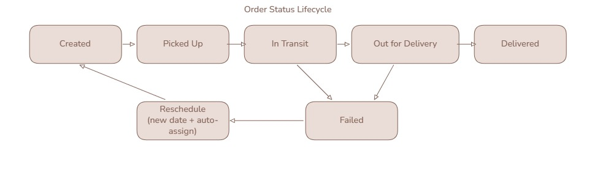
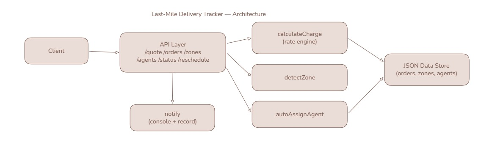

# Last-Mile Delivery Tracker

A simple delivery management demo. Customers and admins create orders with an auto-calculated charge, agents get assigned, order status is tracked with a timeline, and notifications are sent on every status change.

## Architecture



## Order Lifecycle



Built with **plain Node.js only — no external packages** (uses the built-in `http`, `fs`, and `crypto` modules). Data is stored in a `db.json` file.

## Setup

Requires Node.js v18+.

```bash
# no npm install needed - there are no dependencies
npm start
# or:
node server.js
```

Then open http://localhost:3000.

Optional: copy `.env.example` to `.env` to change the port.

## Structure

server.js          zero-dependency Node.js backend (http/fs/crypto only)
db.json            JSON file "database" with seed data
public/index.html  plain HTML+JS frontend (no framework)
package.json       just a "start" script
README.md          setup, API docs, DB schema, rate logic
DESIGN.md          system design write-up (the 800-word deliverable)
.env.example       optional PORT
.gitignore         excludes node_modules/.env/etc.

## Demo Accounts

| Role     | Email             | Password |
|----------|-------------------|----------|
| Admin    | admin@demo.com    | admin123 |
| Agent    | agent1@demo.com   | agent123 |
| Agent    | agent2@demo.com   | agent123 |
| Customer | customer@demo.com | cust123  |

Seed pincodes: North Zone `110001-110003`, South Zone `400001-400003`.

## How To Demo

1. Login as **customer**, create an order (for example pickup `110001`, drop `400001`), click **Get Charge** to preview, then **Confirm Order**.
2. Login as **admin**, click **Auto-assign** on the order.
3. Login as **agent**, move the order through Picked Up → In Transit → Out for Delivery → Delivered. Or click **Fail**, then **Reschedule**.
4. Check `/api/notifications` or the server console to see the emails/SMS.

## Rate Calculation Logic

On order creation the charge is computed from **admin-configured data only**:

1. **Zone detection** — pickup and drop pincodes are looked up in the admin's zone-to-pincode mapping.
2. **Volumetric weight** = `L × B × H ÷ 5000`.
3. **Billed weight** = `max(actual weight, volumetric weight)`.
4. **Rate card** — the card matching the order type (B2B or B2C) is selected; `intraZoneRate` is used if pickup and drop are in the same zone, otherwise `interZoneRate`.
5. **Freight** = `ratePerKg × billedWeight`.
6. **COD surcharge** — added only for COD payments, using the admin-configured surcharge for that order type.
7. **Total** = `freight + codSurcharge` and is shown before the customer confirms.

## Database Schema (db.json)

- **users**: `{ id, email, password, role (admin|agent|customer), name }`
- **zones**: `{ id, name, pincodes[] }`
- **rateCards**: `{ orderType (B2B|B2C), intraZoneRate, interZoneRate }`
- **codSurcharge**: `{ B2B, B2C }`
- **agents**: `{ id, name, zone, available }`
- **orders**: `{ id, customerId, customerEmail, pickup/drop address+pincode, dimensions, actualWeight, orderType, paymentType, charge, status, agentId, rescheduleDate, history[], createdAt }`
- **notifications**: `{ id, orderId, to, message, at }`

`history[]` is the immutable tracking log. Every status change is appended with a timestamp and the actor's role; existing entries are never modified.

## API Docs

Auth: send `Authorization: Bearer <token>` from `/api/login`.

| Method | Path | Role | Description |
|--------|------|------|-------------|
| POST | `/api/register` | public | Register a customer |
| POST | `/api/login` | public | Login, returns a token |
| GET | `/api/zones` | any | List zones |
| POST | `/api/zones` | admin | Add a zone |
| GET | `/api/ratecards` | any | View rate cards + COD |
| PUT | `/api/ratecards` | admin | Update rate cards / COD |
| GET | `/api/agents` | any | List agents |
| POST | `/api/quote` | any | Preview a charge (no order created) |
| POST | `/api/orders` | customer/admin | Create an order |
| GET | `/api/orders` | any | List orders (`?status=&zone=&agent=` filters for admin) |
| GET | `/api/orders/:id` | any | Order + tracking timeline |
| POST | `/api/orders/:id/assign` | admin | Assign agent (`{agentId}` or `{auto:true}`) |
| POST | `/api/orders/:id/status` | agent/admin | Update status |
| POST | `/api/orders/:id/reschedule` | any | Reschedule a failed order (reassigns agent) |
| GET | `/api/notifications` | any | View sent notifications |
